# 📋 Схема БД VoiceLog Industrial (PlantUML)

На основе вашего ТЗ создал полную схему базы данных в формате PlantUML. Это **версия 1.0**, которая соответствует всем требованиям из раздела 1.12 и функциональным требованиям Раздела 2.

---

## 🗄️ Файл: `/docs/db-schema-v1.0.puml`

```plantuml
@startuml
' ============================================================================
' VoiceLog Industrial - Database Schema v1.0
' ============================================================================
' Версия: 1.0
' Дата: 2026-03-09
' Соответствует: ТЗ на оперативный журнал.docx (Раздел 1.12, 2.3, 4.5)
' ============================================================================

' Цветовая схема
skinparam backgroundColor #FFFFFF
skinparam borderColor #2196F3
skinparam entityBackgroundColor #E3F2FD
skinparam entityBorderColor #2196F3
skinparam entityFontColor #212121
skinparam relationshipColor #757575

' ============================================================================
' ТАБЛИЦА: users (Пользователи)
' ============================================================================
entity "users" as users {
    *id : UUID <<PK>>
    --
    username : VARCHAR(50) <<UNIQUE, NOT NULL>>
    email : VARCHAR(100) <<UNIQUE, NOT NULL>>
    password_hash : VARCHAR(255) <<NOT NULL>>
    full_name : VARCHAR(200) <<NOT NULL>>
    role : VARCHAR(20) <<NOT NULL>>
    department : VARCHAR(100)
    is_active : BOOLEAN <<DEFAULT TRUE>>
    last_login_at : TIMESTAMP
    created_at : TIMESTAMP <<DEFAULT NOW()>>
    updated_at : TIMESTAMP <<DEFAULT NOW()>>
}

' Индексы users
note right of users
  <b>Индексы:
  - idx_users_email (email)
  - idx_users_role (role)
  - idx_users_active (is_active) WHERE is_active = TRUE
end note

' ============================================================================
' ТАБЛИЦА: reports (Отчёты)
' ============================================================================
entity "reports" as reports {
    *id : UUID <<PK>>
    --
    user_id : UUID <<FK, NOT NULL>>
    audio_path : VARCHAR(500) <<NOT NULL>>
    audio_hash : VARCHAR(64) <<UNIQUE>>
    audio_duration : INTEGER <<SECONDS>>
    audio_size : INTEGER <<BYTES>>
    transcribed_text : TEXT
    extracted_data : JSONB
    status : VARCHAR(20) <<NOT NULL>>
    confidence_score : DECIMAL(3,2)
    location : VARCHAR(200)
    event_type : VARCHAR(50)
    description : TEXT
    solution : TEXT
    priority : VARCHAR(10)
    reminder_iso : TIMESTAMP
    tags : JSONB
    processing_started_at : TIMESTAMP
    processing_completed_at : TIMESTAMP
    error_message : TEXT
    sync_retries : INTEGER <<DEFAULT 0>>
    created_at : TIMESTAMP <<DEFAULT NOW()>>
    updated_at : TIMESTAMP <<DEFAULT NOW()>>
}

' Индексы reports
note right of reports
  <b>Индексы:
  - idx_reports_user_date (user_id, created_at DESC)
  - idx_reports_status (status) WHERE status != 'completed'
  - idx_reports_search GIN (to_tsvector('russian', transcribed_text))
  - idx_reports_extracted GIN (extracted_data)
  - idx_reports_audio_hash UNIQUE (audio_hash)
  - idx_reports_reminder (reminder_iso) WHERE reminder_iso IS NOT NULL
end note

' ============================================================================
' ТАБЛИЦА: audit_log (Журнал аудита)
' ============================================================================
entity "audit_log" as audit_log {
    *id : UUID <<PK>>
    --
    user_id : UUID <<FK>>
    action : VARCHAR(50) <<NOT NULL>>
    resource_type : VARCHAR(50) <<NOT NULL>>
    resource_id : UUID
    old_value : JSONB
    new_value : JSONB
    ip_address : VARCHAR(45)
    user_agent : TEXT
    created_at : TIMESTAMP <<DEFAULT NOW()>>
}

' Индексы audit_log
note right of audit_log
  <b>Индексы:
  - idx_audit_user (user_id)
  - idx_audit_action (action)
  - idx_audit_resource (resource_type, resource_id)
  - idx_audit_created (created_at DESC)
end note

' ============================================================================
' ТАБЛИЦА: sessions (Сессии пользователей)
' ============================================================================
entity "sessions" as sessions {
    *id : UUID <<PK>>
    --
    user_id : UUID <<FK, NOT NULL>>
    token_hash : VARCHAR(64) <<UNIQUE, NOT NULL>>
    device_id : VARCHAR(100)
    ip_address : VARCHAR(45)
    user_agent : TEXT
    expires_at : TIMESTAMP <<NOT NULL>>
    is_revoked : BOOLEAN <<DEFAULT FALSE>>
    created_at : TIMESTAMP <<DEFAULT NOW()>>
}

' Индексы sessions
note right of sessions
  <b>Индексы:
  - idx_sessions_user (user_id)
  - idx_sessions_token (token_hash)
  - idx_sessions_expires (expires_at) WHERE is_revoked = FALSE
end note

' ============================================================================
' ТАБЛИЦА: sync_queue (Очередь синхронизации)
' ============================================================================
entity "sync_queue" as sync_queue {
    *id : UUID <<PK>>
    --
    user_id : UUID <<FK, NOT NULL>>
    report_id : UUID <<FK>>
    operation : VARCHAR(20) <<NOT NULL>>
    payload : JSONB <<NOT NULL>>
    status : VARCHAR(20) <<DEFAULT 'pending'>>
    retry_count : INTEGER <<DEFAULT 0>>
    last_attempt_at : TIMESTAMP
    error_message : TEXT
    created_at : TIMESTAMP <<DEFAULT NOW()>>
}

' Индексы sync_queue
note right of sync_queue
  <b>Индексы:
  - idx_sync_user_status (user_id, status)
  - idx_sync_created (created_at)
  - idx_sync_report (report_id)
end note

' ============================================================================
' ТАБЛИЦА: reminders (Напоминания)
' ============================================================================
entity "reminders" as reminders {
    *id : UUID <<PK>>
    --
    user_id : UUID <<FK, NOT NULL>>
    report_id : UUID <<FK, NOT NULL>>
    reminder_at : TIMESTAMP <<NOT NULL>>
    title : VARCHAR(200)
    message : TEXT
    is_completed : BOOLEAN <<DEFAULT FALSE>>
    completed_at : TIMESTAMP
    created_at : TIMESTAMP <<DEFAULT NOW()>>
}

' Индексы reminders
note right of reminders
  <b>Индексы:
  - idx_reminders_user (user_id)
  - idx_reminders_time (reminder_at) WHERE is_completed = FALSE
  - idx_reminders_report (report_id)
end note

' ============================================================================
' СВЯЗИ МЕЖДУ ТАБЛИЦАМИ
' ============================================================================

users ||--o{ reports : "создаёт"
users ||--o{ audit_log : "генерирует"
users ||--o{ sessions : "имеет"
users ||--o{ sync_queue : "синхронизирует"
users ||--o{ reminders : "получает"

reports ||--o{ audit_log : "отслеживается"
reports ||--o{ sync_queue : "в очереди"
reports ||--o{ reminders : "имеет напоминания"

' ============================================================================
' СТАТУСЫ (ENUM-подобные значения)
' ============================================================================

note top of reports
  <b>status значения:
  - pending (ожидает обработки)
  - processing (в обработке)
  - completed (завершено)
  - failed (ошибка)
  - review (требует проверки)
end note

note top of users
  <b>role значения:
  - engineer (инженер)
  - supervisor (супервизор)
  - admin (администратор)
end note

note top of sync_queue
  <b>operation значения:
  - CREATE (создание)
  - UPDATE (обновление)
  - DELETE (удаление)
  
  <b>status значения:
  - pending (ожидает)
  - syncing (синхронизируется)
  - synced (синхронизировано)
  - failed (ошибка)
end note

' ============================================================================
' ТРИГГЕРЫ (логические)
' ============================================================================

note bottom of users
  <b>Триггеры:
  - updated_at автоматически обновляется
  - last_login_at при успешном входе
end note

note bottom of reports
  <b>Триггеры:
  - updated_at автоматически обновляется
  - audio_hash вычисляется при загрузке
end note

@enduml
```



---

## ✅ Соответствие ТЗ

| Требование ТЗ | Реализация в схеме |
|--------------|-------------------|
| **1.4.1 Матрица доступа** | `users.role` (engineer/supervisor/admin) |
| **1.7.1 Аудит действий** | Таблица `audit_log` |
| **1.7.2 Оффлайн-режим** | Таблица `sync_queue` |
| **2.2.1 JWT сессии** | Таблица `sessions` |
| **2.2.3 Синхронизация** | `sync_queue` + `reports.sync_retries` |
| **2.3.1 CRUD отчётов** | Таблица `reports` со всеми полями |
| **3.7.4 Статистика** | Агрегация по `reports.created_at` |
| **4.5.2 Индексы БД** | Все индексы указаны в нотации |
| **5.1.6 Напоминания** | Таблица `reminders` |

---

## 📊 ER-диаграмма (визуализация)

```
┌─────────────────────────────────────────────────────────────────────────────┐
│                         SCHEMA RELATIONSHIPS                                │
├─────────────────────────────────────────────────────────────────────────────┤
│                                                                             │
│    ┌──────────┐                                                             │
│    │  users   │─────────────────────────────────────────────┐               │
│    └────┬─────┘                                             │               │
│         │                                                   │               │
│    ┌────┴────────────────────────────────────────────────┐  │               │
│    │                    │                    │           │  │               │
│    ▼                    ▼                    ▼           ▼  ▼               │
│ ┌─────────┐      ┌───────────┐      ┌───────────┐  ┌───────────┐           │
│ │ reports │      │ audit_log │      │ sessions  │  │ sync_queue│           │
│ └────┬────┘      └───────────┘      └───────────┘  └────┬──────┘           │
│      │                                                  │                   │
│      ▼                                                  ▼                   │
│ ┌───────────┐                                   ┌─────────────┐            │
│ │ reminders │                                   │   reports   │            │
│ └───────────┘                                   └─────────────┘            │
│                                                                             │
└─────────────────────────────────────────────────────────────────────────────┘
```

---

## 🔄 Следующие шаги

1. **Сгенерировать SQL миграции** из этой схемы
2. **Добавить в ТЗ Раздел 1.12** ссылку на файл
3. **Свериться с разработчиком** на соответствие реализации
4. **Версионировать** при изменениях (v1.1, v1.2...)

Нужно ли:
- 📝 Сгенерировать SQL-скрипт создания таблиц?
- 🔍 Провести сверку схемы с конкретными требованиями из ТЗ?
- 📋 Добавить описание хранимых процедур/триггеров?
